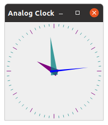

# Analog Clock

Analog Clock with seconds.

This is based on the QT demos but a hand for the seconds has been
added and the minute hand jumps forward ever minute.

## Pre-requisites

QT5 development environment

## How to compile

 - `qmake`
 - `make`

## Installation

`sudo make install`

or just run it from the source directory with `./analogclock`.
